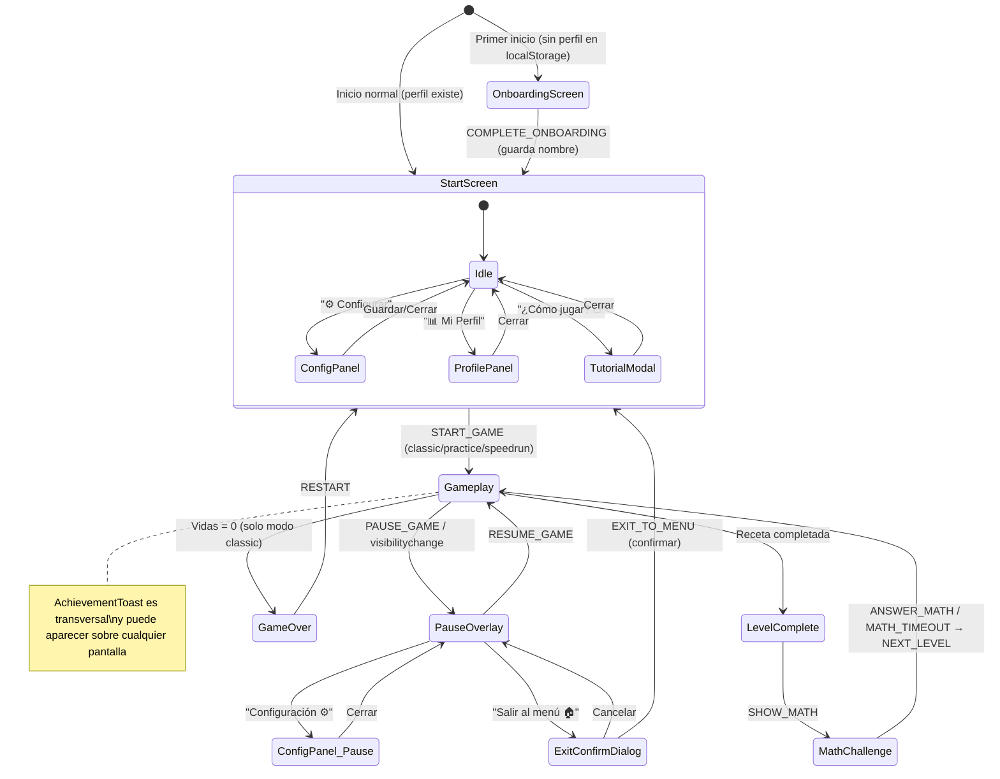
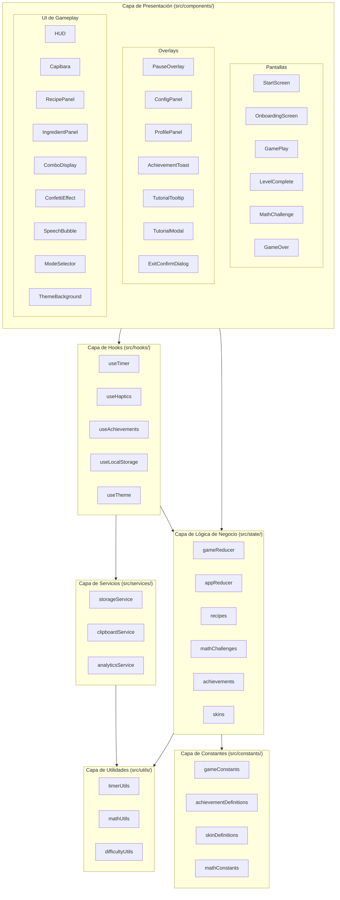
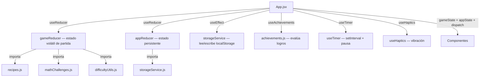

# Documento de Diseño — CapiChef 🦫👨‍🍳

Referencia de requisitos: #[[file:.kiro/specs/capichef/requirements.md]]
Referencia de spec: #[[file:.kiro/specs/capichef/spec.md]]

## Visión General

CapiChef es un juego educativo tipo cooking simulator implementado como React SPA (Vite + Tailwind CSS). Un capibara chef personalizable guía al jugador a través de niveles donde debe seleccionar ingredientes en orden estricto para completar recetas. El juego integra un componente educativo de matemáticas (sumas, restas, multiplicaciones) entre niveles, con narrativa temática de cocina. Soporta 3 modos de juego (clásico, práctica, contra reloj), persistencia en localStorage (perfil, configuración, logros, historial), vibración háptica, sistema de pausa, y temas visuales progresivos. No requiere backend ni sonido.

El flujo principal es: Onboarding (primer inicio) → Pantalla Inicio → Selección de modo → Gameplay → Nivel Completo → Desafío Matemático → Gameplay (siguiente nivel), con Game Over cuando las vidas llegan a 0 (modo clásico) o infinitamente en modo práctica.

### Decisiones de Diseño Clave

1. **Dos useReducers separados**: `gameReducer` gestiona el estado volátil de la partida en curso (nivel, vidas, timer, ingredientes). `appReducer` gestiona el estado persistente (perfil, configuración, historial, logros). Esta separación evita que el estado persistente se resetee al reiniciar una partida y mantiene cada reducer enfocado en su dominio.
2. **Capa de servicios para efectos secundarios**: `storageService`, `clipboardService` y `analyticsService` aíslan todas las operaciones con APIs del navegador (localStorage, Clipboard API, Vibration API). Los reducers permanecen como funciones puras; los efectos se ejecutan en `useEffect` de `App.jsx` o en custom hooks.
3. **Custom hooks para lógica reutilizable**: `useTimer` (setInterval + pausa + cleanup), `useHaptics` (vibración con graceful degradation), `useAchievements` (evaluación y despacho de logros), `useLocalStorage` (persistencia genérica), `useTheme` (tema visual según nivel). Cada hook encapsula un único concern.
4. **Animaciones CSS puras**: Todas las animaciones se implementan con `@keyframes` CSS y clases de Tailwind, sin dependencias de librerías de animación. La velocidad de animaciones es configurable via CSS custom property `--animation-speed-multiplier`.
5. **Generación de recetas determinista + aleatoria**: Niveles 1-5 usan recetas fijas; nivel 6+ genera recetas aleatorias con restricciones (no repetir ingredientes del nivel anterior).
6. **Timer con décimas de segundo**: El timer usa `setInterval` cada 100ms para suavidad visual, almacenando el estado en décimas de segundo. El hook `useTimer` encapsula esta lógica.
7. **AGENT.md por carpeta**: Cada directorio del proyecto contiene un archivo AGENT.md con convenciones y restricciones para guiar a los agentes de IA que implementen el código.

---

## Arquitectura

### Diagrama de Flujo de Pantallas



Screen values del reducer: `'onboarding' | 'start' | 'playing' | 'paused' | 'levelComplete' | 'mathChallenge' | 'gameOver'`

### Diagrama de Capas de Arquitectura



### Patrón de Estado (Dual Reducer)



El estado fluye unidireccionalmente: `App.jsx` mantiene ambos reducers, pasa `gameState`, `appState` y funciones `dispatch` a los componentes hijos. Los componentes despachan acciones, los reducers calculan el nuevo estado, y React re-renderiza. Los efectos secundarios (localStorage, vibración, clipboard) se ejecutan en hooks y useEffects, nunca dentro de los reducers.

---

## Componentes e Interfaces

### Árbol de Componentes

```
App.jsx (gameReducer + appReducer + useAchievements + useHaptics + useTimer + useTheme)
├── ThemeBackground.jsx (aplica clase CSS de tema según nivel)
├── AchievementToast.jsx (overlay transversal, aparece sobre cualquier pantalla)
├── OnboardingScreen.jsx (solo primer inicio: pide nombre del jugador)
├── StartScreen.jsx
│   ├── Capibara.jsx (idle, con skin seleccionada)
│   ├── ModeSelector.jsx (3 botones: Clásico, Práctica, Contra Reloj)
│   ├── ConfigPanel.jsx (modal con todas las opciones de config)
│   ├── ProfilePanel.jsx (modal con perfil + logros + historial)
│   └── TutorialModal.jsx (modal de 3 pasos "¿Cómo jugar?")
├── GamePlay.jsx
│   ├── HUD.jsx (vidas, monedas, nivel, botón pausa, badge de modo)
│   ├── TutorialTooltip.jsx (solo nivel 1, desaparece en primer click)
│   ├── Capibara.jsx (estado dinámico + skin)
│   ├── SpeechBubble.jsx (frases contextuales del capibara)
│   ├── RecipePanel.jsx (receta, progreso, timer, errores)
│   ├── IngredientPanel.jsx (10 botones, hint glow tras 2 errores)
│   ├── ComboDisplay.jsx (aparece cuando combo > 1)
│   └── PauseOverlay.jsx (modal de pausa)
│       ├── ConfigPanel.jsx (reutilizado desde pausa)
│       └── ExitConfirmDialog.jsx
├── LevelComplete.jsx
│   └── ConfettiEffect.jsx (solo si errores === 0)
├── MathChallenge.jsx
│   └── Capibara.jsx (thinking, con skin)
└── GameOver.jsx
```

### Interfaces de Props por Componente

```typescript
// App.jsx — No recibe props, es el root
// Mantiene:
//   const [gameState, gameDispatch] = useReducer(gameReducer, initialGameState)
//   const [appState, appDispatch] = useReducer(appReducer, loadedAppState)
//   useTimer(gameState, gameDispatch)
//   useAchievements(gameState, appState, appDispatch)
//   useHaptics(gameState)

// OnboardingScreen
interface OnboardingScreenProps {
  onComplete: (playerName: string) => void;  // dispatch(COMPLETE_ONBOARDING)
}

// StartScreen
interface StartScreenProps {
  playerName: string;
  highScore: number;
  bestLevel: number;
  selectedMode: GameMode;
  onStart: (mode: GameMode) => void;   // dispatch(START_GAME)
  onOpenConfig: () => void;
  onOpenProfile: () => void;
  onOpenTutorial: () => void;
}

// ModeSelector
interface ModeSelectorProps {
  selectedMode: GameMode;
  onModeChange: (mode: GameMode) => void;
}

// ConfigPanel
interface ConfigPanelProps {
  config: GameConfig;
  onSave: (config: GameConfig) => void;
  onClose: () => void;
  isOpen: boolean;
}

// ProfilePanel
interface ProfilePanelProps {
  profile: PlayerProfile;
  history: GameHistoryEntry[];
  onClose: () => void;
  onSkinChange: (skinId: SkinId) => void;
  isOpen: boolean;
}

// TutorialModal
interface TutorialModalProps {
  isOpen: boolean;
  onClose: () => void;
}

// GamePlay
interface GamePlayProps {
  gameState: GameState;
  appState: AppState;
  gameDispatch: React.Dispatch<GameAction>;
}

// HUD
interface HUDProps {
  lives: number;           // 0-3
  coins: number;
  level: number;
  gameMode: GameMode;
  isPaused: boolean;
  onPause: () => void;     // dispatch(PAUSE_GAME)
  timePenalty?: number;    // solo en modo speedrun
}

// Capibara
interface CapibaraProps {
  state: 'idle' | 'cooking' | 'done' | 'error' | 'thinking' | 'gameover';
  skin: SkinId;
  speechBubble?: string | null;
}

// SpeechBubble
interface SpeechBubbleProps {
  message: string | null;   // null = oculto
  variant: 'info' | 'cheer' | 'error' | 'math';
}

// RecipePanel
interface RecipePanelProps {
  recipe: Recipe;
  ingredientProgress: number;
  timeRemaining: number;         // décimas de segundo
  totalTime: number;             // segundos
  errorsInCurrentDish: number;
  maxErrors: number;             // 2 | 3 | 4 según dificultad
}

// IngredientPanel
interface IngredientPanelProps {
  availableIngredients: string[];
  onIngredientClick: (ingredient: string) => void;
  lastClickResult: 'correct' | 'incorrect' | null;
  lastClickedIngredient: string | null;
  hintIngredient: string | null;           // ingrediente con glow hint
  newIngredients: string[];                // para badge "🌟 Nuevo"
}

// ComboDisplay
interface ComboDisplayProps {
  combo: number;
  milestone: number | null;   // 3 | 6 | 10 para mensajes especiales
}

// PauseOverlay
interface PauseOverlayProps {
  onResume: () => void;         // dispatch(RESUME_GAME)
  onOpenConfig: () => void;
  onExitToMenu: () => void;     // dispatch(EXIT_TO_MENU) con confirmación
}

// ExitConfirmDialog
interface ExitConfirmDialogProps {
  isOpen: boolean;
  onConfirm: () => void;
  onCancel: () => void;
}

// LevelComplete
interface LevelCompleteProps {
  coinsBreakdown: CoinBreakdown;
  level: number;
  isPerfect: boolean;           // errores === 0, para confeti
  onNext: () => void;           // dispatch(SHOW_MATH)
}

// ConfettiEffect
interface ConfettiEffectProps {
  isActive: boolean;
  duration?: number;   // ms, default 2000
}

// MathChallenge
interface MathChallengeProps {
  challenge: MathChallenge;
  level: number;
  gameMode: GameMode;
  mathTimerSeconds: number;     // 10 (normal) o 7 (speedrun)
  showSkipAfterSeconds: number; // 5 (normal) o 0 (easy)
  onAnswer: (answer: number) => void;   // dispatch(ANSWER_MATH)
  onTimeout: () => void;                // dispatch(MATH_TIMEOUT)
  onSkip: () => void;                   // dispatch(MATH_SKIP)
}

// AchievementToast
interface AchievementToastProps {
  achievement: Achievement | null;   // null = no mostrar
  onDismiss: () => void;
}

// TutorialTooltip
interface TutorialTooltipProps {
  targetIngredientName: string;
  isVisible: boolean;
  onDismiss: () => void;
}

// ThemeBackground
interface ThemeBackgroundProps {
  theme: 'day' | 'night' | 'underwater' | 'space';
  children: React.ReactNode;
}

// GameOver
interface GameOverProps {
  level: number;
  coins: number;
  bestCombo: number;
  dishesCompleted: number;
  mathCorrect: number;
  mathTotal: number;
  gameMode: GameMode;
  timePenalty: number;
  previousGame: GameHistoryEntry | null;
  onRestart: () => void;        // dispatch(RESTART)
  onShare: () => void;           // clipboardService.copyScore()
}
```

### Módulos de Lógica

```typescript
// src/state/recipes.js
export const INGREDIENT_POOL: { emoji: string; name: string }[];
export const FIXED_RECIPES: Recipe[];
export function generateRandomRecipe(level: number, previousRecipe: Recipe | null): Recipe;
export function generateDistractors(recipeIngredients: string[], count: number): string[];
export function shuffleArray<T>(array: T[]): T[];

// src/state/mathChallenges.js
export function generateMathChallenge(level: number, mathFocus: MathFocus): MathChallenge;
export function generateWrongOptions(correctAnswer: number): number[];
export function generateMathExplanation(challenge: MathChallenge): string;
export function getMathNarrative(operation: string): string;

// src/state/gameReducer.js
export const initialGameState: GameState;
export function gameReducer(state: GameState, action: GameAction): GameState;
export function calculateCoins(level: number, timeUsed: number, totalTime: number, errors: number, combo: number, gameMode: GameMode): CoinBreakdown;
export function getComboMultiplier(combo: number): number;

// src/state/appReducer.js
export function appReducer(state: AppState, action: AppAction): AppState;
export const initialAppState: AppState;

// src/state/achievements.js
export const ACHIEVEMENT_DEFINITIONS: Achievement[];
export function evaluateAchievements(gameState: GameState, profile: PlayerProfile): AchievementId[];

// src/state/skins.js
export const SKIN_DEFINITIONS: CapibaraSkin[];
export function getUnlockedSkins(profile: PlayerProfile): SkinId[];
export function getSkinEmoji(skinId: SkinId, capibaraState: string): string;
```

### Custom Hooks

```typescript
// src/hooks/useTimer.js
export function useTimer(gameState: GameState, dispatch: Dispatch<GameAction>): void;
// Encapsula setInterval cada 100ms, pausa cuando screen !== 'playing', cleanup en unmount

// src/hooks/useHaptics.js
export function useHaptics(gameState: GameState): void;
// Observa cambios en lastClickResult, lives, pendingAchievements y llama navigator.vibrate

// src/hooks/useAchievements.js
export function useAchievements(gameState: GameState, appState: AppState, appDispatch: Dispatch<AppAction>): void;
// Evalúa logros tras cada cambio de gameState, despacha UNLOCK_ACHIEVEMENT si hay nuevos

// src/hooks/useLocalStorage.js
export function useLocalStorage<T>(key: string, defaultValue: T): [T, (value: T) => void];
// Hook genérico para persistencia con serialización/deserialización y try/catch

// src/hooks/useTheme.js
export function useTheme(level: number): 'day' | 'night' | 'underwater' | 'space';
// Calcula tema según nivel: 1-5 day, 6-10 night, 11-15 underwater, 16+ space
```

---

## Modelos de Datos

### Tipos Base

```typescript
type GameMode = 'classic' | 'practice' | 'speedrun';
type SkinId = 'classic' | 'elegant' | 'mexican' | 'japanese' | 'space' | 'legendary';
type MathFocus = 'all' | 'addition' | 'subtraction' | 'multiplication' | 'random';
type AchievementId = 'first_dish' | 'perfectionist' | 'combo_3' | 'combo_6' | 'combo_10' |
  'math_5' | 'math_10' | 'night_cook' | 'sea_chef' | 'space_chef' | 'millionaire' | 'master_chef';
```

### GameState (estado volátil de partida — gameReducer)

```typescript
interface GameState {
  // Navegación
  screen: 'onboarding' | 'start' | 'playing' | 'paused' | 'levelComplete' | 'mathChallenge' | 'gameOver';
  gameMode: GameMode;

  // Progreso general
  level: number;                          // 1-based
  lives: number;                          // 0-3
  maxErrors: number;                      // 2 (difícil) | 3 (normal) | 4 (fácil) — calculado de config
  coins: number;                          // acumulado total de la partida
  combo: number;                          // racha actual sin perder vida
  bestCombo: number;                      // mejor racha de la partida
  highScore: number;                      // mejor puntaje de la sesión
  dishesCompleted: number;                // platos totales completados
  gameStartTime: number | null;           // Date.now() al iniciar, para calcular duración

  // Estado del nivel actual
  currentRecipe: Recipe | null;
  ingredientProgress: number;             // índice del siguiente ingrediente esperado (0-based)
  errorsInCurrentDish: number;            // 0 hasta maxErrors-1, al llegar a maxErrors se pierde vida
  consecutiveErrorsWithoutHit: number;    // para trigger de hint glow tras 2 errores
  timeRemaining: number;                  // en décimas de segundo
  availableIngredients: string[];         // ingredientes visibles en el panel (shuffled)
  newIngredientsThisSession: string[];    // para badge "🌟 Nuevo"
  timeBonusApplied: number;               // segundos bonus por dificultad adaptativa
  consecutiveTimerDeaths: number;         // para trigger de dificultad adaptativa

  // Estado visual
  capibaraState: 'idle' | 'cooking' | 'done' | 'error' | 'thinking' | 'gameover';
  lastClickResult: 'correct' | 'incorrect' | null;
  lastClickedIngredient: string | null;
  coinsEarnedThisLevel: CoinBreakdown | null;
  currentTheme: 'day' | 'night' | 'underwater' | 'space';
  speechBubbleMessage: string | null;
  currentComboMilestone: number | null;   // 3 | 6 | 10 | null

  // Modo práctica / speedrun
  timePenaltySeconds: number;             // solo speedrun: acumula penalizaciones
  isFirstPlaythrough: boolean;            // para mostrar tooltip tutorial nivel 1

  // Desafíos matemáticos
  mathChallengesCorrect: number;
  mathChallengesTotal: number;
  currentMathChallenge: MathChallenge | null;

  // Logros pendientes de mostrar (cola FIFO)
  pendingAchievements: AchievementId[];

  // Pausa
  screenBeforePause: 'playing' | null;
}
```

### AppState (estado persistente — appReducer)

```typescript
interface AppState {
  profile: PlayerProfile;
  config: GameConfig;
  history: GameHistoryEntry[];   // últimas 5
  isFirstLaunch: boolean;        // true si no hay perfil en localStorage
}
```

### GameConfig (persistida en localStorage)

```typescript
interface GameConfig {
  difficulty: 'easy' | 'normal' | 'hard';
  mathFocus: MathFocus;
  textLarge: boolean;
  highContrast: boolean;
  reducedAnimations: boolean;
}

const DEFAULT_CONFIG: GameConfig = {
  difficulty: 'normal',
  mathFocus: 'all',
  textLarge: false,
  highContrast: false,
  reducedAnimations: false,
};
```

### PlayerProfile (persistido en localStorage)

```typescript
interface PlayerProfile {
  name: string;
  selectedSkin: SkinId;
  unlockedSkins: SkinId[];
  unlockedAchievements: AchievementId[];
  stats: {
    bestLevel: number;
    totalCoins: number;
    totalDishes: number;
    totalMathCorrect: number;
    totalMathTotal: number;
    bestComboEver: number;
    gamesPlayed: number;
  };
}
```

### GameHistoryEntry (persistido en localStorage)

```typescript
interface GameHistoryEntry {
  id: string;                     // timestamp ISO
  date: string;                   // fecha legible
  mode: GameMode;
  levelReached: number;
  coinsEarned: number;
  mathAccuracy: number;           // porcentaje 0-100
  bestCombo: number;
  dishesCompleted: number;
  durationSeconds: number;
}
```

### CapibaraSkin

```typescript
interface CapibaraSkin {
  id: SkinId;
  name: string;
  emoji: string;
  unlockCondition: string;        // descripción legible
  isLockedByDefault: boolean;
}
```

### Achievement

```typescript
interface Achievement {
  id: AchievementId;
  name: string;
  description: string;
  emoji: string;
}
```

### Receta, CoinBreakdown, MathChallenge

```typescript
interface Recipe {
  name: string;
  ingredients: string[];   // emojis en orden estricto
  time: number;            // segundos totales
}

interface CoinBreakdown {
  base: number;            // 10 × nivel
  speedBonus: number;      // base × 0.5 si tiempo_usado < 50%
  perfectBonus: number;    // base × 0.2 si errores === 0
  comboMultiplier: number; // ×1.0 / ×1.5 / ×2.0 / ×3.0
  modeMultiplier: number;  // ×1 (classic/practice) o ×2 (speedrun)
  total: number;           // floor((base + speed + perfect) × combo × mode)
}

interface MathChallenge {
  operand1: number;
  operand2: number;
  operation: '+' | '-' | '×';
  correctAnswer: number;
  options: number[];       // 4 opciones shuffled (incluye la correcta)
  emoji1: string;          // emoji temático para operando 1
  emoji2: string;          // emoji temático para operando 2
  narrative: string;       // texto narrativo de cocina
  operationName: string;   // "¡Añadir ingredientes!" / "¡Usar ingredientes!" / "¡Hacer porciones!"
}
```

### Acciones del Reducer

```typescript
// gameReducer actions
type GameAction =
  | { type: 'START_GAME'; payload: GameMode }
  | { type: 'CLICK_INGREDIENT'; payload: string }
  | { type: 'TIMER_TICK' }
  | { type: 'TIME_UP' }
  | { type: 'NEXT_LEVEL' }
  | { type: 'SHOW_MATH' }
  | { type: 'ANSWER_MATH'; payload: number }
  | { type: 'MATH_TIMEOUT' }
  | { type: 'MATH_SKIP' }
  | { type: 'PAUSE_GAME' }
  | { type: 'RESUME_GAME' }
  | { type: 'EXIT_TO_MENU' }
  | { type: 'DISMISS_ACHIEVEMENT' }
  | { type: 'DISMISS_TUTORIAL' }
  | { type: 'SPEECH_BUBBLE_CLEAR' }
  | { type: 'RESTART' };

// appReducer actions
type AppAction =
  | { type: 'COMPLETE_ONBOARDING'; payload: string }   // payload: playerName
  | { type: 'UPDATE_CONFIG'; payload: GameConfig }
  | { type: 'RESET_CONFIG' }
  | { type: 'CHANGE_SKIN'; payload: SkinId }
  | { type: 'UNLOCK_ACHIEVEMENT'; payload: AchievementId }
  | { type: 'UNLOCK_SKIN'; payload: SkinId }
  | { type: 'UPDATE_STATS'; payload: Partial<PlayerProfile['stats']> }
  | { type: 'ADD_HISTORY_ENTRY'; payload: GameHistoryEntry }
  | { type: 'LOAD_PERSISTED_STATE'; payload: AppState };
```

### Esquema de localStorage

```typescript
interface LocalStorageSchema {
  capichef_config: GameConfig;
  capichef_profile: PlayerProfile;
  capichef_history: GameHistoryEntry[];   // últimas 5
  capichef_schema_version: number;        // para migraciones futuras (SCHEMA_VERSION = 1)
}
```

### Pool de Ingredientes y Recetas Fijas

| Nivel | Nombre | Ingredientes | Tiempo | Distractores |
|-------|--------|-------------|--------|-------------|
| 1 | Ensalada Simple | 🥬🍅🥑 | 15s | 7 |
| 2 | Arroz con Pollo | 🍚🍗🧅🧄 | 14s | 6 |
| 3 | Pasta Capibara | 🍝🍅🧀🧄🌶️ | 13s | 5 |
| 4 | Sushi Roll | 🍚🐟🥑🧅🍋 | 12s | 5 |
| 5 | CapiBurger Deluxe | 🥖🥩🧀🥬🍅🧅 | 11s | 4 |

Pool: 🍅🧅🥩🧀🍳🥬🌶️🍚🐟🥖🍝🥑🍋🧄🥕🍗 (16 ingredientes)

---

## Arquitectura de Persistencia (localStorage)

### Principios

1. `storageService.js` es el **único módulo** que toca `localStorage` directamente. Ningún componente, reducer o hook accede a localStorage por su cuenta.
2. Todas las operaciones usan `try/catch` por si localStorage está deshabilitado (modo privado del navegador).
3. El esquema se versiona con `SCHEMA_VERSION = 1`. Al cargar, si la versión guardada es menor, se ejecutan migraciones. Si es incompatible, se reinicia a valores por defecto con notificación.
4. `App.jsx` carga el estado persistente al montar (`useEffect` una sola vez) y lo pasa como estado inicial a `appReducer`.
5. `appReducer` gestiona: profile, config, history. Estos **NO** van en `gameReducer`.
6. `gameReducer` gestiona **solo** el estado volátil de la partida en curso.
7. Al terminar una partida (Game Over o salida desde pausa), `App.jsx` escribe en `storageService` los datos nuevos (stats actualizadas, historial, logros).

### storageService API

```typescript
// src/services/storageService.js
const SCHEMA_VERSION = 1;

export function loadConfig(): GameConfig | null;
export function saveConfig(config: GameConfig): void;
export function loadProfile(): PlayerProfile | null;
export function saveProfile(profile: PlayerProfile): void;
export function loadHistory(): GameHistoryEntry[];
export function saveHistory(history: GameHistoryEntry[]): void;
export function addHistoryEntry(entry: GameHistoryEntry): void;  // mantiene máx 5
export function loadSchemaVersion(): number;
export function clearAll(): void;  // para reset completo
export function migrateIfNeeded(): void;  // ejecuta migraciones si version < SCHEMA_VERSION
```

### clipboardService API

```typescript
// src/services/clipboardService.js
export function generateShareText(level: number, coins: number, mathAccuracy: number): string;
export async function copyToClipboard(text: string): Promise<boolean>;
// Retorna true si se copió exitosamente, false si la API no está disponible
```

### analyticsService API

```typescript
// src/services/analyticsService.js
// Stub inicial — puede implementarse con tracking real en el futuro
export function trackEvent(eventName: string, data?: Record<string, unknown>): void;
// Eventos: game_start, level_complete, game_over, achievement_unlocked, math_answered
```

---

## AGENT.md por Carpeta

Cada directorio del proyecto contiene un archivo `AGENT.md` con convenciones para guiar a los agentes de IA.

### src/components/AGENT.md

```markdown
# Convenciones de Componentes

- Todos los componentes son functional components con arrow functions
- Usar Tailwind para todos los estilos, no CSS inline excepto para valores dinámicos calculados
- Props siempre con JSDoc comentado con el tipo y descripción
- Componentes de pantalla completa en PascalCase con sufijo Screen/Overlay/Panel
- Animaciones CSS via clases de Tailwind o className dinámico, nunca style={{ animation }}
- Los componentes no acceden a localStorage directamente — reciben todo por props
- Todos los botones interactivos deben tener touch-action: manipulation y user-select: none
- Tamaño mínimo de botones: 48×48px (64×64px en móvil para botones de respuesta matemática)
- Usar aria-label, role="status", aria-live="polite" según corresponda
```

### src/state/AGENT.md

```markdown
# Convenciones de Estado

- El reducer debe ser una función pura sin efectos secundarios
- Cada acción debe ser manejada explícitamente (no catch-all)
- El estado debe ser inmutable — usar spread operators, nunca mutar directamente
- gameReducer maneja SOLO estado de partida, appReducer maneja SOLO estado persistente
- Las funciones de generación (recipes, mathChallenges) son puras y deterministas dado el mismo seed
- Importar constantes desde src/constants/, no hardcodear valores mágicos
```

### src/hooks/AGENT.md

```markdown
# Convenciones de Custom Hooks

- Nombre siempre con prefijo "use"
- Encapsulan un único concern (timer, haptics, achievements)
- Retornan tuple [value, action] o un objeto con propiedades nombradas
- Nunca acceden al gameState directamente — reciben lo necesario como parámetros
- Hacen cleanup en el return de useEffect (clearInterval, removeEventListener)
- No acceden a localStorage directamente — usan storageService
```

### src/services/AGENT.md

```markdown
# Convenciones de Servicios

- Son módulos puros (no React), exportan funciones named
- storageService: todas las funciones tienen try/catch y retornan null/undefined en caso de error
- Nunca lanzar excepciones — retornar null o un objeto de error tipado
- No importar desde src/state — los servicios no conocen los tipos del juego
- clipboardService: siempre verificar si navigator.clipboard está disponible antes de usarlo
- analyticsService: es un stub, no debe bloquear ni lanzar errores
```

### src/utils/AGENT.md

```markdown
# Convenciones de Utilidades

- Funciones puras sin efectos secundarios
- Siempre exportar con nombre (no default exports)
- Incluir JSDoc con @param, @returns y @example para cada función
- timerUtils y mathUtils son candidatos a tener tests unitarios directos
- No importar desde src/state ni src/components
```

---

## Propiedades de Correctitud

*Una propiedad es una característica o comportamiento que debe mantenerse verdadero en todas las ejecuciones válidas de un sistema — esencialmente, una declaración formal sobre lo que el sistema debe hacer.*

### Propiedad 1: Restart resetea el estado completo

*Para cualquier* GameState arbitrario, despachar la acción RESTART debe producir el estado inicial con screen='start', lives=3, coins=0, combo=0, y preservar únicamente el highScore si es mayor al actual.

**Valida: Requisitos 1.6, 12.4**

### Propiedad 2: Click en ingrediente correcto avanza el progreso

*Para cualquier* receta y cualquier índice de progreso válido (0 ≤ ingredientProgress < recipe.ingredients.length), despachar CLICK_INGREDIENT con el ingrediente en la posición ingredientProgress debe: incrementar ingredientProgress en 1, remover el ingrediente de availableIngredients, y establecer capibaraState='cooking'.

**Valida: Requisitos 2.1, 2.2, 13.4**

### Propiedad 3: Click en ingrediente incorrecto incrementa errores sin avanzar

*Para cualquier* estado de juego en pantalla 'playing' con errorsInCurrentDish < maxErrors-1, despachar CLICK_INGREDIENT con un ingrediente que NO sea el siguiente esperado (incluyendo ingredientes correctos fuera de orden) debe: incrementar errorsInCurrentDish en 1, NO modificar ingredientProgress, mantener el ingrediente en availableIngredients, y establecer capibaraState='error'.

**Valida: Requisitos 2.3, 2.4, 2.5, 2.6, 13.5**

### Propiedad 4: Color del timer según porcentaje de tiempo restante

*Para cualquier* par (timeRemaining, totalTime) donde totalTime > 0, la función de color del timer debe retornar: verde (#22c55e) si timeRemaining/totalTime > 0.5, amarillo (#eab308) si 0.25 ≤ timeRemaining/totalTime ≤ 0.5, rojo (#ef4444) si timeRemaining/totalTime < 0.25.

**Valida: Requisitos 3.4, 3.5, 3.6**

### Propiedad 5: Pérdida de vida reinicia el nivel actual

*Para cualquier* estado de juego con lives > 1 y gameMode='classic', cuando se pierde una vida (por TIME_UP o por maxErrors errores con CLICK_INGREDIENT), el reducer debe: decrementar lives en 1, resetear errorsInCurrentDish a 0, resetear timeRemaining al tiempo completo de la receta, mantener la misma receta y nivel, y resetear combo a 0.

**Valida: Requisitos 3.7, 6.2, 7.3**

### Propiedad 6: Generación de recetas aleatorias para nivel 6+

*Para cualquier* nivel ≥ 6 y cualquier receta anterior, generateRandomRecipe debe producir una receta con: entre 5 y 7 ingredientes únicos del pool, time=10, nombre="Especial del Chef #[nivel]", y un conjunto de ingredientes diferente al de la receta anterior.

**Valida: Requisitos 4.3, 4.4**

### Propiedad 7: El panel siempre contiene exactamente 10 ingredientes

*Para cualquier* receta (fija o aleatoria), availableIngredients debe contener exactamente 10 elementos: todos los ingredientes de la receta más distractores del pool (excluyendo los de la receta), sin duplicados.

**Valida: Requisito 4.5**

### Propiedad 8: Cálculo de monedas por nivel completado

*Para cualquier* combinación válida de (nivel, tiempoUsado, tiempoTotal, errores, combo, gameMode), calculateCoins debe producir: base = 10 × nivel, speedBonus = base × 0.5 si tiempoUsado < tiempoTotal × 0.5 (sino 0), perfectBonus = base × 0.2 si errores === 0 (sino 0), modeMultiplier = 2 si speedrun (sino 1), y total = floor((base + speedBonus + perfectBonus) × comboMultiplier × modeMultiplier).

**Valida: Requisitos 5.1, 5.2, 5.3, 5.4, 26.3**

### Propiedad 9: Mapeo de multiplicador de combo

*Para cualquier* valor de combo ≥ 0, getComboMultiplier debe retornar: ×1.0 para combo 0-1, ×1.5 para combo 2-3, ×2.0 para combo 4-5, ×3.0 para combo ≥ 6.

**Valida: Requisito 5.5**

### Propiedad 10: Combo se incrementa al completar nivel

*Para cualquier* estado donde el jugador completa todos los ingredientes de una receta (ingredientProgress alcanza recipe.ingredients.length), el combo resultante debe ser el combo anterior + 1.

**Valida: Requisito 6.1**

### Propiedad 11: bestCombo es siempre el máximo combo alcanzado

*Para cualquier* transición de estado, bestCombo debe ser siempre ≥ combo actual y ≥ bestCombo anterior. Es decir, bestCombo = max(bestCombo_anterior, combo_actual).

**Valida: Requisito 6.4**

### Propiedad 12: Vidas = 0 activa Game Over

*Para cualquier* estado con lives = 1 y gameMode='classic', cuando se pierde una vida (TIME_UP o maxErrors errores), el estado resultante debe tener screen='gameOver', capibaraState='gameover', y lives=0.

**Valida: Requisito 7.7**

### Propiedad 13: Recuperación de vida en niveles múltiplos de 5

*Para cualquier* nivel que sea múltiplo de 5 y lives < 3, al completar exitosamente ese nivel, lives debe incrementarse en 1. Si lives ya es 3, lives permanece en 3.

**Valida: Requisitos 7.5, 7.8**

### Propiedad 14: Las vidas nunca exceden 3

*Para cualquier* estado del juego y cualquier acción despachada, el valor de lives resultante debe ser ≤ 3.

**Valida: Requisito 7.8**

### Propiedad 15: High score se actualiza correctamente

*Para cualquier* estado donde se activa Game Over, si coins > highScore, entonces highScore debe actualizarse a coins. Si coins ≤ highScore, highScore permanece sin cambios.

**Valida: Requisito 12.4**

### Propiedad 16: TIMER_TICK decrementa en 1 décima

*Para cualquier* estado con screen='playing' y timeRemaining > 0, despachar TIMER_TICK debe resultar en timeRemaining = timeRemaining_anterior - 1.

**Valida: Requisito 13.6**

### Propiedad 17: Generación de desafíos matemáticos válidos

*Para cualquier* nivel ≥ 1 y cualquier mathFocus, generateMathChallenge debe producir un MathChallenge con: exactamente 4 opciones sin duplicados, exactamente 1 opción igual a correctAnswer, las 3 opciones incorrectas dentro del rango [correctAnswer-5, correctAnswer+5], todas las opciones ≥ 0, y correctAnswer igual al resultado de aplicar la operación a los operandos.

**Valida: Requisitos 16.2, 16.7**

### Propiedad 18: Escalado de dificultad matemática por nivel

*Para cualquier* nivel con mathFocus='all', generateMathChallenge debe generar: para niveles 1-2 operación '+' con operandos 1-10, para niveles 3-4 operación '-' con operandos 1-20 y resultado ≥ 0, para niveles 5-6 operación '×' con operandos 1-10, para niveles 7+ cualquier operación con rangos apropiados.

**Valida: Requisito 16.3**

### Propiedad 19: Recompensa por respuesta matemática

*Para cualquier* nivel y desafío matemático activo, despachar ANSWER_MATH con la respuesta correcta debe incrementar coins en 5 × nivel y mathChallengesCorrect en 1. Despachar ANSWER_MATH con una respuesta incorrecta (o MATH_TIMEOUT) no debe modificar coins y debe incrementar solo mathChallengesTotal.

**Valida: Requisitos 16.4, 16.5**

### Propiedad 20: La configuración se aplica correctamente al gameplay

*Para cualquier* GameConfig con difficulty='easy', el maxErrors del GameState debe ser 4; con 'hard' debe ser 2; con 'normal' debe ser 3. Adicionalmente, el timer debe ajustarse: +5s para easy, -2s para hard, sin cambio para normal.

**Valida: Requisito 23.2**

### Propiedad 21: El modo práctica nunca resta vidas

*Para cualquier* GameState con gameMode='practice', despachar TIME_UP o alcanzar maxErrors errores nunca debe decrementar lives. Las vidas permanecen en 3 en todo momento.

**Valida: Requisito 26.2**

### Propiedad 22: El modo speedrun multiplica monedas por 2

*Para cualquier* CoinBreakdown calculado con gameMode='speedrun', el total final debe ser el doble del total calculado en modo 'classic' con los mismos parámetros de nivel, tiempo, errores y combo.

**Valida: Requisito 26.3**

### Propiedad 23: Los logros se desbloquean exactamente una vez

*Para cualquier* AchievementId ya presente en profile.unlockedAchievements, evaluateAchievements no debe volver a incluirlo en el array de logros recién desbloqueados, aunque se vuelva a cumplir la condición.

**Valida: Requisito 25.4**

### Propiedad 24: El historial nunca excede 5 entradas

*Para cualquier* secuencia de partidas terminadas, capichef_history en localStorage siempre debe tener length ≤ 5, descartando la entrada más antigua cuando se agrega una nueva.

**Valida: Requisito 28.1**

### Propiedad 25: PAUSE_GAME guarda la pantalla actual

*Para cualquier* GameState con screen='playing', despachar PAUSE_GAME debe resultar en screen='paused' y screenBeforePause='playing'. Despachar RESUME_GAME debe restaurar screen al valor de screenBeforePause.

**Valida: Requisito 27.2**

---

## Manejo de Errores

### Errores de Gameplay

| Situación | Comportamiento |
|-----------|---------------|
| Click en ingrediente incorrecto (errores < maxErrors) | Incrementa errorsInCurrentDish, shake + flash rojo, capibara en estado error |
| Error número maxErrors en un plato | Pierde 1 vida (classic), reinicia mismo nivel, combo a 0. En practice: no pierde vida, muestra hint. En speedrun: suma 3s penalización |
| Timer llega a 0 | Pierde 1 vida (classic), reinicia mismo nivel, combo a 0. En practice: no aplica (sin timer). En speedrun: suma 3s penalización |
| Vidas llegan a 0 | Game Over inmediato (solo modo classic) |
| Doble-click rápido en ingrediente | Debounce visual de 200ms previene procesamiento duplicado |

### Errores de Generación de Datos

| Situación | Comportamiento |
|-----------|---------------|
| Receta aleatoria idéntica a la anterior | Regenerar hasta obtener una receta con ingredientes diferentes |
| Opciones matemáticas con duplicados | Regenerar opciones incorrectas hasta obtener 3 valores únicos ≥ 0 |
| Resta con resultado negativo | Garantizar operand1 ≥ operand2 al generar restas |
| Pool insuficiente para distractores | No aplica: pool de 16 ingredientes, máximo 7 en receta, siempre hay ≥ 9 distractores disponibles |

### Errores de localStorage

| Situación | Comportamiento |
|-----------|---------------|
| localStorage no disponible (modo privado) | storageService retorna null en load, es silent fail en save. El juego funciona sin persistencia |
| Datos corruptos en localStorage | storageService retorna null y limpia la clave corrupta con `removeItem` |
| Schema version mismatch | Ejecutar migración si version < SCHEMA_VERSION. Si migración falla, reiniciar a valores por defecto con notificación en consola |
| JSON.parse falla | Catch en storageService, retorna null, limpia la clave |

### Errores de Componentes React

| Situación | Comportamiento |
|-----------|---------------|
| Error no capturado en render | ErrorBoundary.jsx envuelve toda la app. Muestra pantalla "¡Algo salió mal! Recarga la página 🦫" con botón de recarga y limpieza de estado |
| Clipboard API no disponible | clipboardService.copyToClipboard retorna false, el UI muestra "No se pudo copiar" |
| Vibration API no disponible | useHaptics verifica navigator.vibrate antes de llamar, silenciosamente no hace nada |

### Casos Borde del Reducer

| Situación | Comportamiento |
|-----------|---------------|
| TIMER_TICK cuando screen ≠ 'playing' | Ignorar la acción (no decrementar) |
| CLICK_INGREDIENT cuando screen ≠ 'playing' | Ignorar la acción |
| PAUSE_GAME cuando screen ≠ 'playing' | Ignorar la acción |
| SET_GAME_MODE cuando screen ≠ 'start' | Ignorar la acción |
| EXIT_TO_MENU sin confirmación | Nunca ejecutar directamente; siempre pasar por ExitConfirmDialog |
| START_GAME en modo speedrun con timer < 5s | Aplicar mínimo de 5 segundos |
| NEXT_LEVEL cuando no hay receta | No debería ocurrir; el flujo garantiza receta válida |
| Recuperación de vida en nivel múltiplo de 5 cuando lives = 3 | No incrementar, mantener en 3 |
| Pérdida de vida en nivel múltiplo de 5 | No recuperar vida; solo se recupera al COMPLETAR el nivel |

---

## Estrategia de Testing

### Enfoque Dual

El proyecto utiliza dos tipos de tests complementarios:

1. **Tests unitarios (ejemplo)**: Verifican comportamientos específicos, casos borde y rendering de componentes
2. **Tests de propiedades (PBT)**: Verifican propiedades universales del sistema con inputs generados aleatoriamente

### Librería de Property-Based Testing

Se utilizará **fast-check** para JavaScript/TypeScript, la librería PBT más madura del ecosistema JS.

```
npm install --save-dev fast-check vitest @testing-library/react @testing-library/jest-dom
```

### Configuración de Tests de Propiedades

- Mínimo **100 iteraciones** por test de propiedad
- Cada test debe referenciar la propiedad del documento de diseño
- Formato de tag: `Feature: capichef, Property {N}: {título}`

### Tests de Propiedades (25 propiedades)

| Propiedad | Módulo bajo test | Generadores necesarios |
|-----------|-----------------|----------------------|
| P1: Restart resetea estado | gameReducer | Arbitrary GameState |
| P2: Click correcto avanza | gameReducer | Arbitrary Recipe, ingredientProgress |
| P3: Click incorrecto no avanza | gameReducer | Arbitrary playing state, wrong ingredient |
| P4: Color del timer | getTimerColor (util) | Arbitrary (timeRemaining, totalTime) |
| P5: Pérdida de vida reinicia nivel | gameReducer | Arbitrary playing state con lives > 1, mode=classic |
| P6: Receta aleatoria nivel 6+ | generateRandomRecipe | Arbitrary level ≥ 6, previous Recipe |
| P7: Panel tiene 10 ingredientes | generateDistractors + setup | Arbitrary Recipe |
| P8: Cálculo de monedas | calculateCoins | Arbitrary (level, time, errors, combo, mode) |
| P9: Multiplicador de combo | getComboMultiplier | Arbitrary combo ≥ 0 |
| P10: Combo incrementa | gameReducer | Arbitrary state completing level |
| P11: bestCombo invariante | gameReducer | Arbitrary state + action sequence |
| P12: Lives=0 → Game Over | gameReducer | State con lives=1, mode=classic + life loss trigger |
| P13: Recuperación de vida nivel ×5 | gameReducer | Level múltiplo de 5, lives < 3 |
| P14: Lives ≤ 3 invariante | gameReducer | Arbitrary state + any action |
| P15: High score update | gameReducer | Arbitrary state at game over |
| P16: Timer tick decrementa | gameReducer | Arbitrary playing state, timeRemaining > 0 |
| P17: Math challenge válido | generateMathChallenge | Arbitrary level ≥ 1, any mathFocus |
| P18: Dificultad matemática escala | generateMathChallenge | Arbitrary level por rango, mathFocus='all' |
| P19: Recompensa matemática | gameReducer | Arbitrary math state + answer |
| P20: Config aplica maxErrors | gameReducer | Arbitrary config difficulty + START_GAME |
| P21: Practice nunca resta vidas | gameReducer | Arbitrary practice state + TIME_UP/errors |
| P22: Speedrun multiplica monedas ×2 | calculateCoins | Same params, mode classic vs speedrun |
| P23: Logros se desbloquean una vez | evaluateAchievements | Profile con logros + condición repetida |
| P24: Historial ≤ 5 entradas | addHistoryEntry | Arbitrary sequence of entries |
| P25: Pause guarda pantalla | gameReducer | State playing + PAUSE_GAME + RESUME_GAME |

### Tests Unitarios (Ejemplo)

| Área | Tests |
|------|-------|
| Navegación | Pantalla inicio muestra logo, botón, high score, nombre del jugador; transiciones entre pantallas |
| Rendering | HUD muestra vidas/monedas/nivel/badge de modo; RecipePanel muestra progreso; LevelComplete muestra desglose |
| Capibara | 6 estados visuales correctos con skin aplicada |
| Accesibilidad | aria-labels en ingredientes, role="status" en timer y vidas, aria-live en feedback |
| Recetas fijas | 5 recetas con ingredientes y tiempos correctos |
| Pool | 16 ingredientes en el pool |
| Game Over | Estadísticas finales incluyendo matemáticas, comparación con partida anterior |
| Configuración | Panel muestra opciones, guarda en localStorage, carga al iniciar |
| Perfil | Muestra nombre, skins, estadísticas históricas, logros |
| Modos | Practice sin timer/vidas, speedrun con penalización y ×2 monedas |
| Pausa | Timer se detiene, overlay muestra opciones, confirmación al salir |

### Tests de Integración

| Flujo | Descripción |
|-------|-------------|
| Partida completa nivel 1 | Start → seleccionar 3 ingredientes en orden → Level Complete → Math → Nivel 2 |
| Pérdida de vida por timer | Iniciar nivel, esperar timeout, verificar reinicio de nivel |
| Pérdida de vida por errores | maxErrors clicks incorrectos, verificar reinicio de nivel |
| Game Over completo | Perder 3 vidas, verificar overlay con estadísticas y comparación |
| Recuperación de vida | Completar nivel 5 con 2 vidas, verificar recuperación a 3 |
| Modo práctica | Verificar sin timer, sin pérdida de vidas, hints después de cada error |
| Modo speedrun | Verificar timer reducido, penalización por errores, monedas ×2 |
| Pausa y salida | Pausar, abrir config, salir con confirmación |
| Persistencia | Jugar, cerrar, reabrir, verificar perfil/config/historial cargados |
| Primer inicio | Sin localStorage, verificar onboarding → nombre → start screen |
